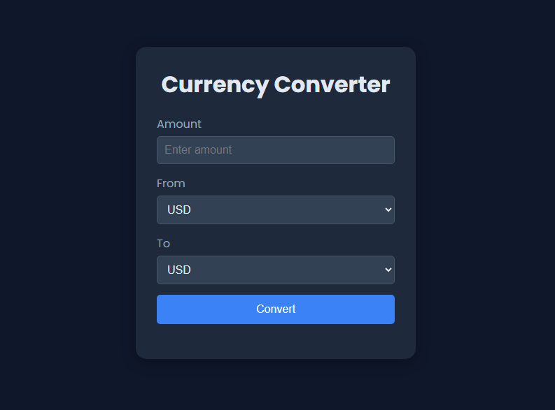

# 💱 Currency Converter App

A simple, responsive currency converter web app built using **HTML**, **CSS**, and **JavaScript**. It fetches real-time exchange rates from the [ExchangeRate API](https://www.exchangerate-api.com/) and allows users to convert between different world currencies.

## 🚀 Features

- 🌐 Live exchange rates
- 🔄 Convert from any currency to another
- 🎨 Dark mode UI with responsive layout
- 🧠 Input validation to prevent invalid amounts
- 📱 Fully responsive for mobile, tablet, and desktop

## 📸 Preview

## ⚙️ API Used

Exchange Rate API
🔗 [https://api.exchangerate-api.com/v4/latest/USD](https://api.exchangerate-api.com/v4/latest/USD)

> *Note:* You can replace this with any other public exchange rate API (like [exchangerate.host](https://exchangerate.host)) if this one becomes deprecated or rate-limited.

## ✨ Future Improvements

* 💾 Cache rates for offline use
* 📊 Show historical conversion trends
* ⚠️ Better error handling for failed API requests
* 🌍 Add language/localization support
